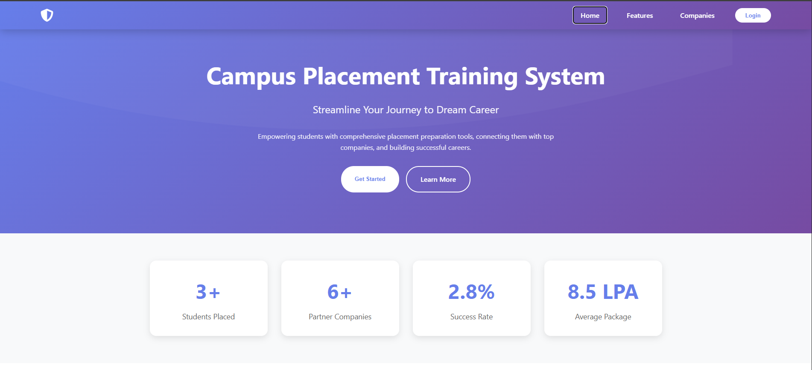

# Campus Placement Training System

A comprehensive web-based platform developed using **Django** to streamline campus placement preparation by providing students with structured training modules and enabling placement coordinators to monitor, evaluate, and manage student progress from a centralized dashboard.

The system integrates essential placement preparation activities—including **AI-powered Resume Analysis, Aptitude Assessment, Mock Interviews, Group Discussions, Placement Drive Management, and Progress Tracking**—into a single platform. It is designed to improve students' technical, analytical, and communication skills while providing coordinators with data-driven insights to guide and support students throughout the placement process.

---

# Table of Contents

* Project Overview
* Objectives
* Key Features
* Technology Stack
* System Architecture
* Project Structure
* Installation
* Configuration
* Running the Application
* Application URLs
* User Roles
* System Workflow
* Security Features
* Development Commands
* Troubleshooting
* Future Enhancements
* License

---

# Project Overview

Campus placement preparation often requires students to use multiple independent platforms for aptitude practice, resume building, interview preparation, and placement notifications. This fragmented approach makes it difficult for students to track their overall progress and equally challenging for placement coordinators to monitor student readiness.

The **Campus Placement Training System** addresses these challenges by providing a centralized platform where students can prepare for recruitment through structured learning modules while coordinators supervise performance, organize training activities, and analyze progress through dedicated dashboards.

The platform combines traditional placement preparation with AI-powered evaluation tools to deliver personalized feedback, enabling students to continuously improve their employability and placement readiness.

---
# screenshots

## Home Page

The landing page provides secure authentication and allows users to log in or register as either a student or placement coordinator.



---

## Student Dashboard

The student dashboard serves as the central workspace for placement preparation, providing access to modules such as Resume Analysis, Aptitude Tests, Mock Interviews, Group Discussions, Placement Drives, and personalized progress tracking.


---

## Coordinator Dashboard

The coordinator dashboard enables placement coordinators to monitor student performance, manage training activities, oversee placement drives, and analyze overall placement readiness through a centralized administrative interface.


# Objectives

The primary objectives of the project are:

* Provide a centralized platform for placement preparation.
* Improve students' aptitude, communication, technical, and interview skills.
* Enable AI-assisted resume analysis and ATS compatibility checking.
* Conduct online aptitude assessments.
* Simulate real interview experiences through mock interviews.
* Facilitate Group Discussion (GD) practice sessions.
* Track student progress across all training modules.
* Allow placement coordinators to manage and evaluate student performance.
* Improve placement readiness through continuous assessment and feedback.

---

# Key Features

## Authentication & User Management

* Student Registration
* Placement Coordinator Registration
* Secure Email-Based Authentication
* Role-Based Authorization
* Password Encryption
* Protected Dashboards
* Secure Session Management

---

## AI Resume Checker

Students can upload resumes for intelligent evaluation.

The system analyzes:

* Resume Structure
* ATS Compatibility
* Formatting
* Grammar and Language
* Skills Representation
* Project Presentation
* Keyword Optimization
* Resume Completeness

Students receive actionable suggestions to improve their resumes before applying for placements.

---

## Aptitude Assessment

The aptitude module enables students to practice and evaluate their analytical abilities.

Features include:

* Timed Assessments
* Multiple Choice Questions
* Automatic Evaluation
* Instant Score Generation
* Topic-wise Analysis
* Performance Reports

---

## Mock Interview

The mock interview module simulates real interview scenarios to improve students' confidence and communication skills.

Students can:

* Practice HR Interviews
* Practice Technical Interviews
* Receive AI-generated Feedback
* Improve Communication Skills
* Review Interview Performance

---

## Group Discussion (GD)

Students can participate in structured Group Discussion sessions to improve:

* Communication Skills
* Leadership
* Critical Thinking
* Team Collaboration
* Public Speaking
* Confidence

---

## Placement Drive Management

Placement Coordinators can manage recruitment activities by:

* Publishing Placement Drives
* Managing Eligibility Criteria
* Accepting Student Registrations
* Scheduling Recruitment Events
* Tracking Student Participation

---

## Progress Tracking

The platform continuously records student performance.

Performance indicators include:

* Aptitude Scores
* Resume Evaluation Scores
* Interview Performance
* Group Discussion Performance
* Training Completion Status
* Overall Placement Readiness

Students can monitor their improvement, while coordinators gain valuable insights into training effectiveness.

---

## Coordinator Dashboard

The coordinator dashboard provides complete control over placement activities.

Capabilities include:

* Student Management
* Performance Monitoring
* Progress Analytics
* Placement Readiness Reports
* Department-wise Statistics
* Individual Student Reports
* Training Activity Management

---

# Technology Stack

| Category             | Technology                                          |
| -------------------- | --------------------------------------------------- |
| Programming Language | Python 3                                            |
| Backend Framework    | Django                                              |
| Frontend             | HTML5, CSS3, JavaScript                             |
| Database             | SQLite                                              |
| Authentication       | Django Authentication System                        |
| AI Services          | Resume Analysis, ATS Evaluation, Interview Feedback |
| Version Control      | Git & GitHub                                        |

---

# System Architecture

```text
                        Campus Placement Training System

                           +----------------------+
                           |      Web Browser     |
                           +----------+-----------+
                                      |
                                      |
                         HTTP Requests / Responses
                                      |
                                      |
                           +----------v-----------+
                           |    Django Backend    |
                           +----------+-----------+
                                      |
          +---------------------------+---------------------------+
          |                           |                           |
          |                           |                           |
+---------v---------+      +----------v----------+      +---------v---------+
| Authentication    |      | Placement Modules  |      | Coordinator Panel |
+-------------------+      +--------------------+      +-------------------+
          |                           |                           |
          |                           |                           |
          +-------------+-------------+-------------+-------------+
                        |                           |
                +-------v-------+          +--------v--------+
                | SQLite Database|          | AI Microservices|
                +---------------+          +-----------------+
```

---

# Project Structure

```text
campus_placement/
│
├── campus_placement/
│   ├── settings.py
│   ├── urls.py
│   ├── asgi.py
│   └── wsgi.py
│
├── accounts/
│   ├── models.py
│   ├── views.py
│   ├── forms.py
│   ├── urls.py
│   └── admin.py
│
├── core/
│   ├── views.py
│   ├── urls.py
│   └── apps.py
│
├── templates/
│   ├── index.html
│   ├── student_register.html
│   ├── coordinator_register.html
│   ├── student_dashboard.html
│   └── coordinator_dashboard.html
│
├── static/
│   ├── css/
│   ├── js/
│   └── images/
│
├── ats-ai-service/
│   ├── main.py
│   └── AI Services
│
├── manage.py
├── requirements.txt
├── db.sqlite3
└── README.md
```

---

# Installation

## Clone the Repository

```bash
git clone <repository-url>
cd campus_placement_project
```

## Create a Virtual Environment

### Windows

```bash
python -m venv venv
venv\Scripts\activate
```

### Linux/macOS

```bash
python3 -m venv venv
source venv/bin/activate
```

## Install Dependencies

```bash
pip install -r requirements.txt
```

---

# Configuration

Apply database migrations:

```bash
python manage.py makemigrations
python manage.py migrate
```

Create an administrator account (optional):

```bash
python manage.py createsuperuser
```

---

# Running the Application

### Run Django and AI Services

```bash
python manage.py runall
```

### Run Django Only

```bash
python manage.py runserver
```

### Run AI Services Separately

```bash
cd ats-ai-service
uvicorn main:app --port 8001
```

---

# Application URLs

| Page                     | URL                     |
| ------------------------ | ----------------------- |
| Home                     | http://127.0.0.1:8000/  |
| Student Registration     | /register/student/      |
| Coordinator Registration | /register/coordinator/  |
| Student Dashboard        | /student/dashboard/     |
| Coordinator Dashboard    | /coordinator/dashboard/ |
| Django Admin             | /admin/                 |

---

# User Roles

## Student

Students can:

* Register and authenticate securely
* Upload resumes for AI evaluation
* Practice aptitude tests
* Attend mock interviews
* Participate in Group Discussions
* View assessment history
* Track overall placement readiness

---

## Placement Coordinator

Placement Coordinators can:

* Manage student accounts
* Monitor training progress
* Publish placement drives
* Organize assessments
* Review analytics and reports
* Evaluate placement readiness
* Guide students through training activities

---

# System Workflow

```text
Student / Coordinator
          │
          ▼
      Login/Register
          │
          ▼
 Authentication
          │
          ▼
 Role Verification
          │
     ┌────┴─────┐
     │          │
     ▼          ▼
Student      Coordinator
Dashboard     Dashboard
     │          │
     ▼          ▼
Training     Student
Modules      Management
     │          │
     └────┬─────┘
          ▼
 Performance Tracking
          │
          ▼
 Progress Analytics
```

---

# Security Features

* Role-Based Authentication
* Custom User Model
* Password Hashing
* CSRF Protection
* Login Required Access
* Cross-Role Access Restriction
* Session Management
* Django Password Validation

---

# Development Commands

Create migrations

```bash
python manage.py makemigrations
```

Apply migrations

```bash
python manage.py migrate
```

Create administrator

```bash
python manage.py createsuperuser
```

Run Django Server

```bash
python manage.py runserver
```

Run Django + AI Services

```bash
python manage.py runall
```

Open Django Shell

```bash
python manage.py shell
```

---

# Troubleshooting

### Database Issues

If migration errors occur:

```bash
rm db.sqlite3
python manage.py makemigrations
python manage.py migrate
```

---

### Static Files

Ensure that:

* `STATIC_URL` is configured correctly.
* Static files are located in the appropriate directory.

---

### Authentication Issues

Verify:

* Email address
* Password
* Database migrations
* User registration

---

# Future Enhancements

The platform can be extended with additional capabilities such as:

* AI-powered career recommendations
* Coding assessment platform
* Company recruitment portal
* Certificate generation
* Email and SMS notifications
* Advanced analytics dashboard
* Student ranking system
* Placement eligibility prediction
* Interview scheduling
* Multi-college support

---

# License

This project is developed for educational and academic purposes. It demonstrates the implementation of a comprehensive placement training and management platform using Django and AI-powered services.
